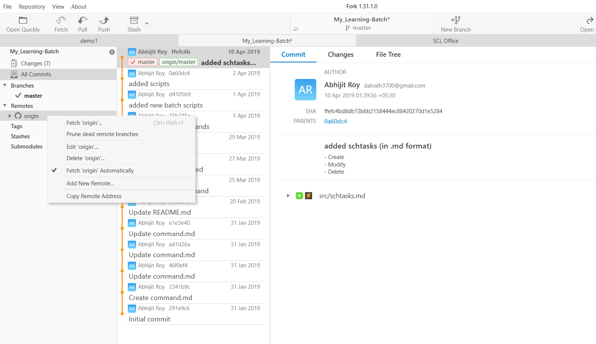
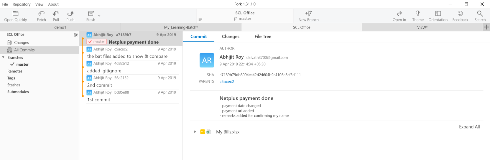

## FAQs (Frequently Asked Questions)
* #### Does it detect if any folder is created inside a `git` repository?
	No.<br/>
	
	It detects file changes:
	- add a file
	- rename a file
	- delete a file
	- edit the file content

* #### Can Auto-fetch be turned ON for a git repository?
	Yes. it can be done like this __Right click on origin on the left pane__ in Git-Fork Application:

	

	In the image above, you can see __Fetch 'origin' Automatically__ (ticked) on the left pane. This means that it would fetch the repository always when the Fork is opened.

* #### Can we automatically `pull` and `push` all the time?
	Yes, it can be done using a batch file (created inside the repository).

	In an Intranet (like Office), it depends on 2 things:
	- the Server computer (where the repository is)
		+ RAM
		+ CPU 
	- the network cable connection (max. upload & download speed)

	So, it is __not recommended__ to use synchronization (i.e. push & pull) all the time.

* #### Suppose in a team, someone has pushed and then deleted a file and then pushed again. What will be shown in this case? Can the file (with deleted content) be retrieved ever?
	Both. All the change logs will be maintained once it is pushed. <br/>

	Yes, the file (with deleted content) can be retrieved by going back to the point (in chain history), where the file is available and start a new branch from there. Also, you can rename this new branch as __Master__ and discard the other mis-leading branch by renaming as something else.

* #### What will happen to a file if 2 or more persons are concurrently editing a file?
	Suppose, there are 2 users - A and B.
	
	There is a file - "file.txt" with following content.
	```text
	Ramesh is a good boy.
	```

	User __A__ edits the file as:
	```text
	Ramesh is a good boy.
	A is a good boy.
	```

	Concurrently, User __B__ edits the file as:
	```text
	Ramesh is a good boy.
	B is a good boy.
	```

	And suppose, user __A__ pushed the file. And After sometime, user __B__ pushes the file with his content above.

	Now, the software asks to `pull` first (in order to sync) and then would allow to push the change (if any).

	The final content would be like this:
	```text
	Ramesh is a good boy.
	B is a good boy.
	```	
	as user __B__ pushed his content last.

	But the beauty here is that if both agrees to discard __B__'s content, then it can be reverted to __A__'s content and then move ahead from there.

* #### What if I don't have a server and record the changes for myself? Is it doable?
	Yes! <br/>
	As many people would like to record changes for individual purpose. In this case, follow this procedure:
	- the folder needs to initiated with `.git` using `Fork Client` application. 
	- `stage` the changes, basically select file(s) to be recorded.
	- `commit` the changes, basically record the changes with any comment(s).
	- No need to `push` the __repository__, as you don't have any server (as per your choice).

	The following picture shows the repository (named __SCL Office__), maintained without any server (basically, no `push` used, but `stage` + `commit`):

	

	In the image above, you can find there is no `origin/master` (i.e. master branch of Remote server), but only `master` (i.e. master branch of locally stored folder)


