# ViEW (Version control system in Excel, Word)
#### Version: 0.1
A software tool to use Git in Office | Excel, Word

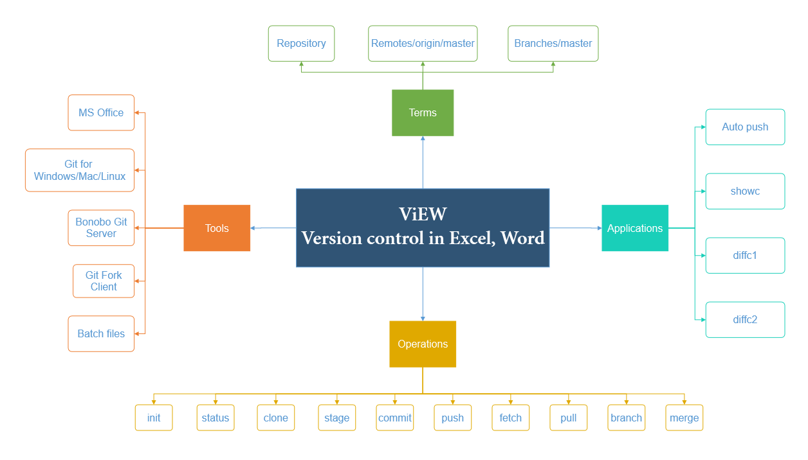

## Tools Installation
### MS Excel 2013 Professional Plus
* MS Excel with `spreadsheet-compare` inside it, would help to compare 2 versions of a file side-by-side. <br/>
	The `spreadsheetcomapre.exe` file is normally available (depends on MS Office version) in this directory - __"C:\Program Files (x86)\Microsoft Office\Office15\DCF"__. 
	<p align="left">
	  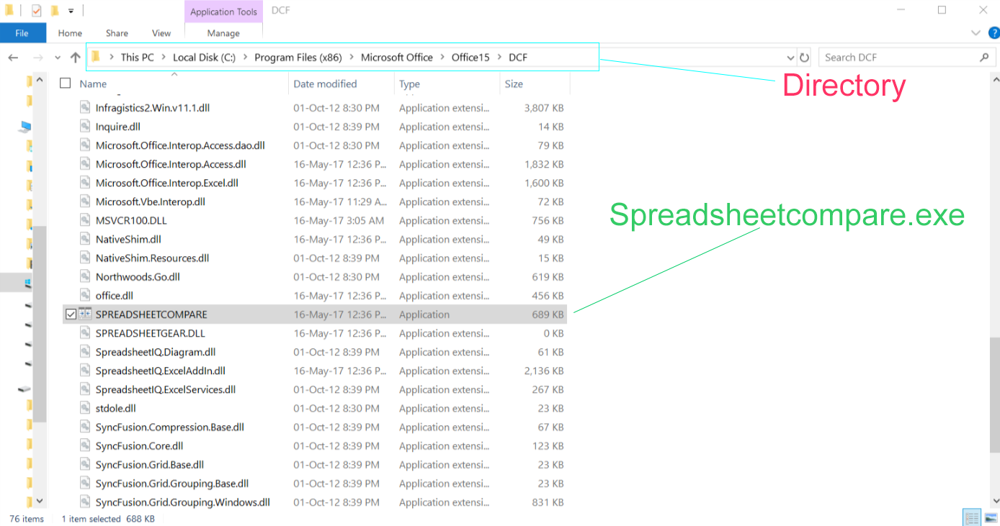
	</p>

* It looks like this:
	<p align="left">
	  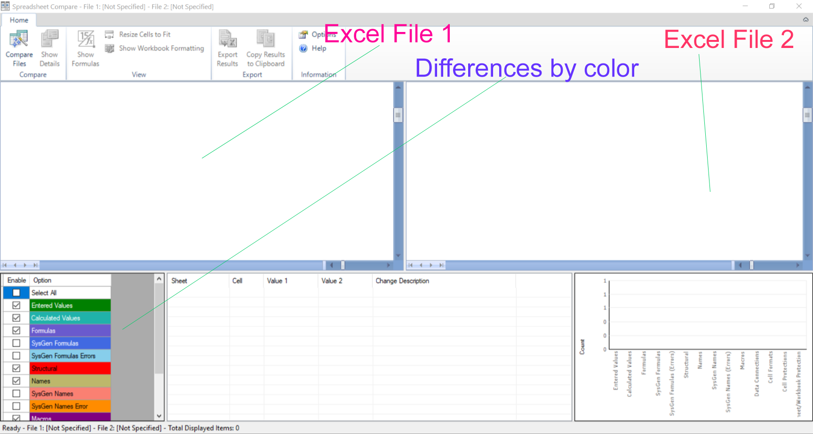
	</p>
* Comparing 2 versions of a file in spreadsheetcompare:
	<p align="left">
	  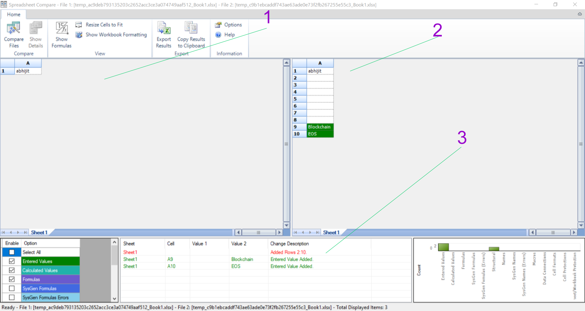
	</p>

	In the Image above, <br/>
	<kbd>1</kbd> - A version (Old) of an Excel file (__Book1.xlsx__) on `22 Mar 2019 11:18:26` <br/>
	<kbd>2</kbd> - Another (New) version of an Excel file (__Book1.xlsx__) on `24 Mar 2019 13:51:52`<br/>
	<kbd>3</kbd> - Shown the differences by color. Entered values in green color, <br/>


### [Git for Windows](./Installation/Git%20for%20Windows)
* Follow the Instructions as per the [setup file](./Installation/Git%20for%20Windows/Git-2.21.0-64-bit.exe)
	> In order to work properly i.e. provide __Unix__ features in __Windows__, tick/untick as per the images provided below.
* __Components Installation__
	<p align="left">
	  
	</p>
* __Config Terminal Emulator__
	<p align="left">
	  
	</p>
* __Extra options__
	<p align="left">
	  
	</p>
* __Use Git from Command line__
	<p align="left">
	  
	</p>
* __Choosing HTTP Transport Backend__
	<p align="left">
	  
	</p>
* __Config line style__
	<p align="left">
	  
	</p>
* __Use Sublime Text 3 as editor__
	<p align="left">
	  
	</p>


### [Batch programs](./Installation/Batch%20programs)
* Mainly there are 3 batch files, which are to be used for Excel, Word file types:
	- `showc`: Show a Word/Excel file on a specific datetime.
	- `diffc1`: Compare 2 versions (past & latest) of a Word/Excel file on 2 different datetime.
	- `diffc2`: Compare 2 versions (on 2 different dates) of a Word/Excel file on 2 different datetime.

### Set Environment PATH variable
* Add location of __Developer folder__ (e.g. "F:\Developer") to Environment PATH variable in Windows PC/Desktop.
	
	__Folder structure:__ 
	```console
	.
	|-- .gitignore
	|-- diffc1.bat
	|-- diffc2.bat
	|-- gitsetup.bat
	|-- openinst3.bat
	|-- showc.bat
	```

	Here, execute in Command prompt.

	__Step 1: Open in Command Line__
	<p align="center">
	  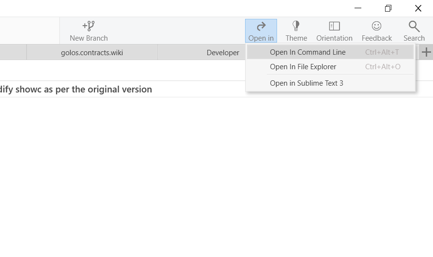
	</p>

	__Step 2: Execute gitsetup.bat file__
	<p align="center">
	  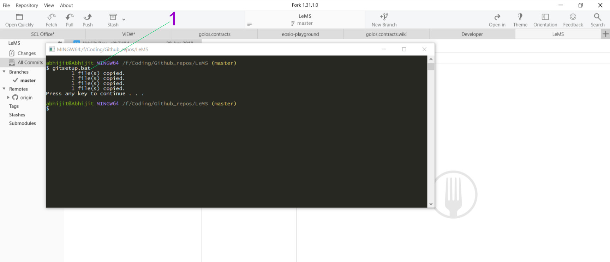
	</p>

	In the Image above,
	<kbd>1</kbd> - type `gitsetup.bat` and enter.


### [Bonobo Git Server](./Installation/Bonobo%20Git%20Server)
#### Installation
[Prerequisites](https://bonobogitserver.com/prerequisites/)

* Go to Control Panel - "Turn Windows Features On/Off"
* tick the "Internet Information Services" and Apply.
* Then, to install .NET Framework and ASP.NET support, follow this:
	- under "IIS -> World Wide Web Services -> Application Development Features"
	- Tick the followings and Apply.
		+ .NET Extensibility 4.7
		+ ASP.NET 4.7
		+ ISAPI Extensions
		+ ISAPI Filters
* Now, the prerequisites are installed.

[Bonobo Installation from Internet](https://bonobogitserver.com/install/) <br/>
[Bonobo Installation from Local folder](./Installation/Bonobo%20Git%20Server/Bonobo%20Git%20Server_v6_3_0.zip)

**Follow the steps:**
* Extract the Zip folder to "C:\inetpub\wwwroot" directory as shown in the image below -
	<p align="center">
	  
	</p>

* Set the permission (Modify, Write) for the App_Data folder inside Bonobo.Git.Server.
* Open IIS Manager. Goto "Right Click" on Bonobo.Git.Server and Convert to Application.
* Click on Authentication of Bonobo.Git.Server and enable Anonymous Authentication.

[Images folder](./Installation/Bonobo%20Git%20Server/images/)

#### Explore
* #### Admin page
	Default credentials are username: _admin_ password: _admin_
	<p align="center">
	  
	</p>

* #### Change Admin details
	<p align="center">
	  
	</p>
* #### Manage Users
	__Step 1:__
	<p align="center">
	  
	</p>

	In the Image above, <br/>
	<kbd>1</kbd> - Click on this to see the list of users <br/>
	<kbd>2</kbd> - Create new User <br/>
	<kbd>3</kbd> - A user created named - __Abhijit__ <br/>
	<kbd>4</kbd> - Admin is also a user <br/>

	__Step 2:__
	<p align="center">
	  
	</p>
	
	In the Image above, fill all the user details (along with password) and then press <kbd>Create</kbd> button.

* #### List of Repositories
	<p align="center">
	  
	</p>
	
	In the Image above, <br/>
	<kbd>1</kbd> - A missing repository (deleted from explorer) <br/>
	<kbd>2</kbd> - A existing repository <br/>
	<kbd>3</kbd> - Create New repository <br/>
	<kbd>4</kbd> - Repository's URL (e.g. "http://localhost/Bonobo.Git.Server/demo1.git") <br/>
	<kbd>5</kbd> - Edit repository details (add/delete users, repository details...) <br/>
	<kbd>6</kbd> - Delete the repository from Server side.

* #### Create New Repository
	<p align="center">
	  
	</p>
	
	Fill the repository details, add/delete contributors and then press <kbd>Create</kbd> button.

* #### Team list
	<p align="center">
	  
	</p>

	In the Image above, there is no team created as yet.

* #### Create Team
	<p align="center">
	  
	</p>

	In the Image above, add users in your team. Give the details and then press the <kbd>Save</kbd> button.
	
* #### Repository Browser
	Click on a repository (say, demo1) in the __Repositories Page__. It will be shown as below:
	<p align="center">
	  
	</p>

* #### Settings page
	<p align="center">
	  
	</p>

	- change the default location to your choice
	- Allow user repository creation
	- Allow push to create repos
	- Allow push for anonymous repos
	- Show commit author avatar

### [Fork Git Client](./Installation/Fork%20Git%20Client)
#### Standard
* Click the Setup file and install it as per instruction.
	> NOTE: No Administrator permission required.
* After Installation, it would ask for User details- `User Name`, `Email`. Give your full name and Office's email address.
	This would help in recording the author details when making any file changes.

	> NOTE: Although in the beginning, user details are taken, but for each repository there is an option to use different user details as well.

	__Global User credentials:__ Can be used for all repository
	<p align="center">
	  
	</p>
	In the Image above, <br/>
	<kbd>1</kbd> - Click the Repository Settings to bring the dialog. <br/>
	<kbd>2</kbd> - Tick to use the global user credentials for this repository.  <br/>
	<kbd>3</kbd> - Full name (of global) for this repository. Asked during Installation.  <br/>
	<kbd>4</kbd> - Email address (of global) for this repository. Asked during Installation. <br/>

 
	__Local User credentials:__ Can be used for a repository
	<p align="center">
	  
	</p>
	In the Image above, <br/>
	<kbd>1</kbd> - Click the Repository Settings to bring the dialog. <br/>
	<kbd>2</kbd> - Untick to use different user credentials (other than global) for this repository. <br/>
	<kbd>3</kbd> - Full name for this repository. <br/>
	<kbd>4</kbd> - Email address for this repository. <br/>

#### Advanced
* __Open in Sublime Text 3__
	If am Universal Editor is needed, __`Sublime Text 3`__ can be used in that case.

	Also, it can be merged with the Fork Client.

	__Step 1:__
	<p align="center">
	  
	</p>
	
	In the Image above, <br/>
	<kbd>1</kbd> - Click __File__ menu option <br/>
	<kbd>2</kbd> - Click __Preferences..__
	
	__Step 2:__
	<p align="center">
	  
	</p>
	
	In the Image above, <br/>
	<kbd>1</kbd> - Now, click the __Custom Actions__

	__Step 3:__
	<p align="center">
	  
	</p>
	
	In the Image above, <br/>
	<kbd>2</kbd> - Click the __+__ symbol to create the custom action.

	__Step 4:__
	<p align="center">
	  
	</p>
	
	In the Image above, <br/>
	<kbd>1</kbd> - Click this to show the custom action dialog.

	__Step 5:__
	<p align="center">
	  
	</p>
	
	In the Image above, <br/>
	<kbd>1</kbd> - Write the title for custom action <br/>
	<kbd>2</kbd> - Link the `.bat` or `.exe` file (from Developer folder, explained above) to open __Sublime Text 3__ in current repository path.

	__Step 6:__
	<p align="center">
	  
	</p>
	
	In the Image above, <br/>
	<kbd>1</kbd> - Finally, this opens __Sublime Text 3__ for current repository.

	__Step 7:__
	<p align="center">
	  
	</p>
	
	In the Image above, <br/>
	<kbd>1</kbd> - This is how the repository looks like in __Sublime Text 3__.

	> NOTE: Now, this can be used especially, if someone is maintaining project directory with version control, this __Sublime Text 3__ is really going to be helpful while coding practice (with too many custom themes with modern colors.)


## Terms
1. #### `Repository` <br/>
	__Repository__ is termed as any folder with files (any format), sub-folders inside it.

	<p align="left">
	  
	</p>

2. #### `remotes/origin/master` <br/>
	It refers to the __master__ (or main) branch of the repository kept at remote server.
	<p align="center">
	  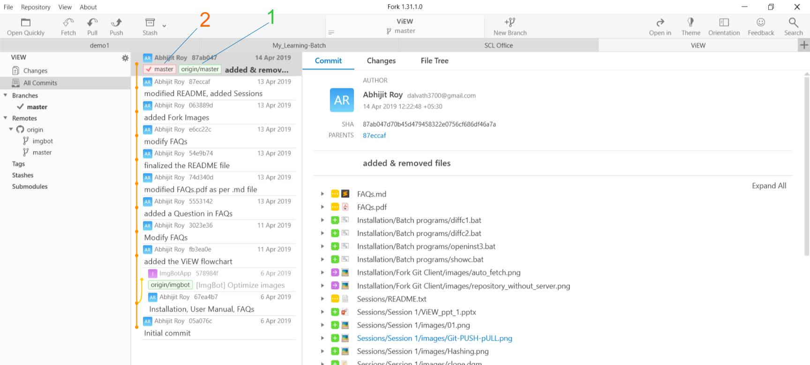
	</p>

	In the image above, <br/>
	<kbd>1</kbd> - shows the `origin/master`, basically the master (or main) branch of repository (named - ViEW) kept at remote location.

3. #### `branch/master` <br/>
	It refers to the __master__ (or main) branch of the repository (named - ViEW) kept at local storage (like PC, desktop).

	In the image above,<br/>
	<kbd>2</kbd> - shows the `branches/master`, basically the master (or main) branch of folder kept at local location.

	> NOTE: Both the masters (at remote & local) are in sync.

## Operations
1. #### `init` <br/>
	It refers to initializing a non-git (or normal) folder to git repository.
	<p align="left">
	  
	</p>	

	Example: <br/>
	__Normal repository:__
	<p align="center">
	  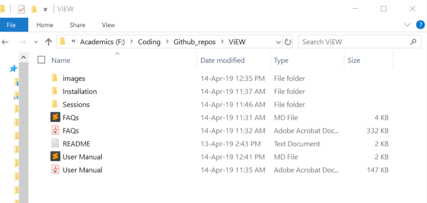
	</p>

	__Git repository:__
	<p align="center">
	  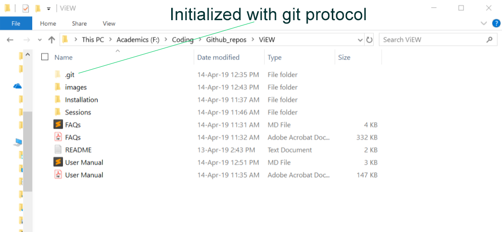
	</p>

	> NOTE: From now onwards, __Git repository__ will be called as __repository__ (in short).

2. #### `status` <br/>
	It shows the status of the files (inside repository) changed. To see the changes (if any), click "Changes" on the left pane of Fork Application. 

	__Example 1: Status showing file changes__
	<p align="center">
	  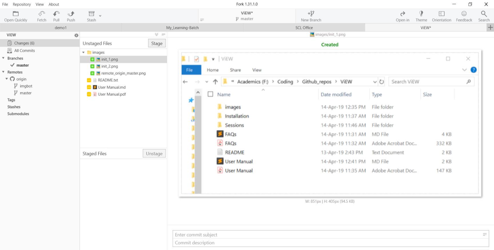
	</p>

	__Example 2: Status showing NO file changes__
	<p align="center">
	  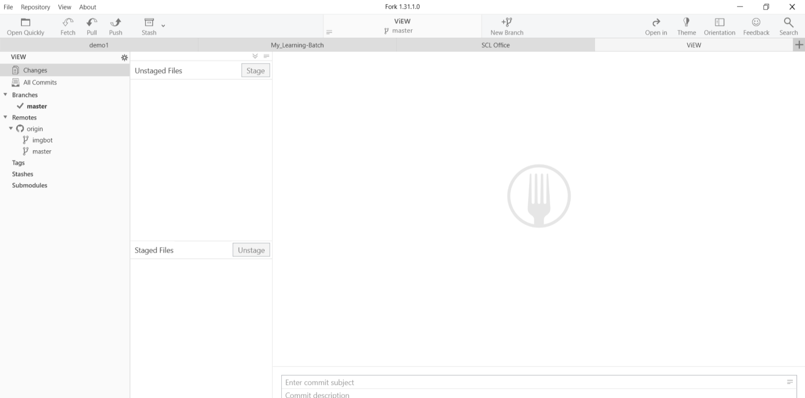
	</p>

3. #### `clone` <br/>
	This is to clone/download the repository (from remote location) to a desired directory in the local PC/Desktop.
	<p align="left">
	  
	</p>

	__Example: Clone a repository__
	<p align="center">
	  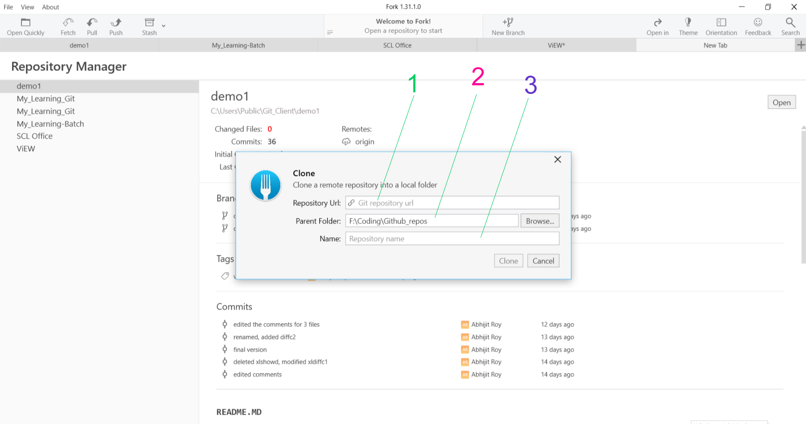
	</p>
	In the Image above, <br/>
	<kbd>1</kbd> - Remote URL of the repository. E.g.: "http://localhost/Bonobo.Git.Server/demo1.git" <br/>
	<kbd>2</kbd> - Local directory where the repository is to be cloned. <br/>
	<kbd>3</kbd> - Custom Name for the cloned repository. <br/>

4. #### `stage` <br/>
	Add file(s) to the Staging area. It's like adding/registering files for recording changes (in the repository).
	<p align="center">
	  
	</p>
	
	In the image above, user has to stage the file(s) to __Staging area__ before recording changes.

	__Example: Unstaged Files__
	<p align="center">
	  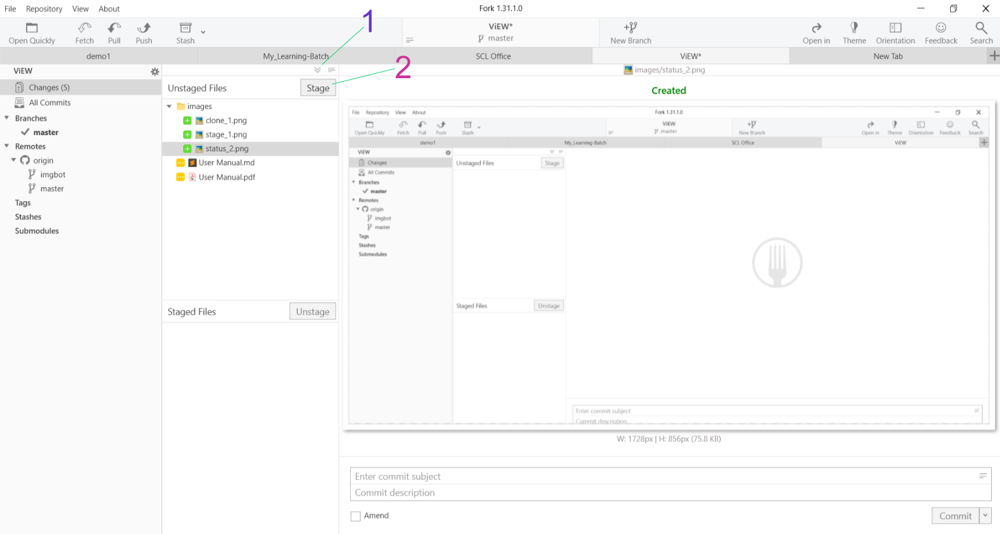
	</p>
	In the Image above, <br/>
	<kbd>1</kbd> - Stage all file(s) <br/>
	<kbd>2</kbd> - Stage selected file(s) <br/>

	__Example: Staged Files__
	<p align="center">
	  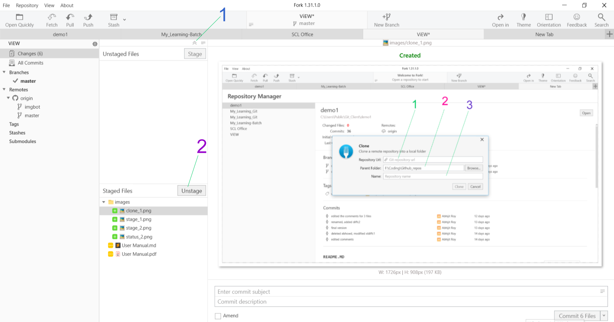
	</p>
	In the Image above, <br/>
	<kbd>1</kbd> - Unstage all file(s) <br/>
	<kbd>2</kbd> - Unstage selected file(s) <br/>

5. #### `commit` <br/>
	This is to record file changes and add it to the chain history. Here, __commit__ means assigning a random unique no. (called as Cryptographic Hash) to a change.
	<p align="center">
	  
	</p>	

	__Example: Commit the Staged files__
	<p align="center">
	  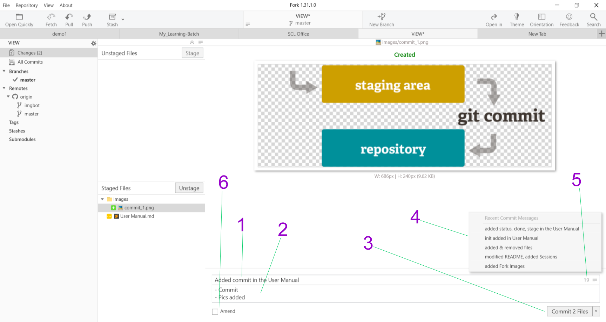
	</p>	
	In the Image above, <br/>
	<kbd>1</kbd> - Commit Message Title <br/>
	<kbd>2</kbd> - Commit Message Description <br/>
	<kbd>3</kbd> - Commit button (when clicked => committed/recorded) <br/>
	<kbd>4</kbd> - Old Commit Message Titles. Can be used when repetitive title required. <br/>
	<kbd>5</kbd> - Show Old commit message titles <br/>
	<kbd>6</kbd> - Amend button i.e. when clicked, automatically uses last message title and description<br/>

	__Example: Commit added to the Chain history__ 
	<p align="center">
	  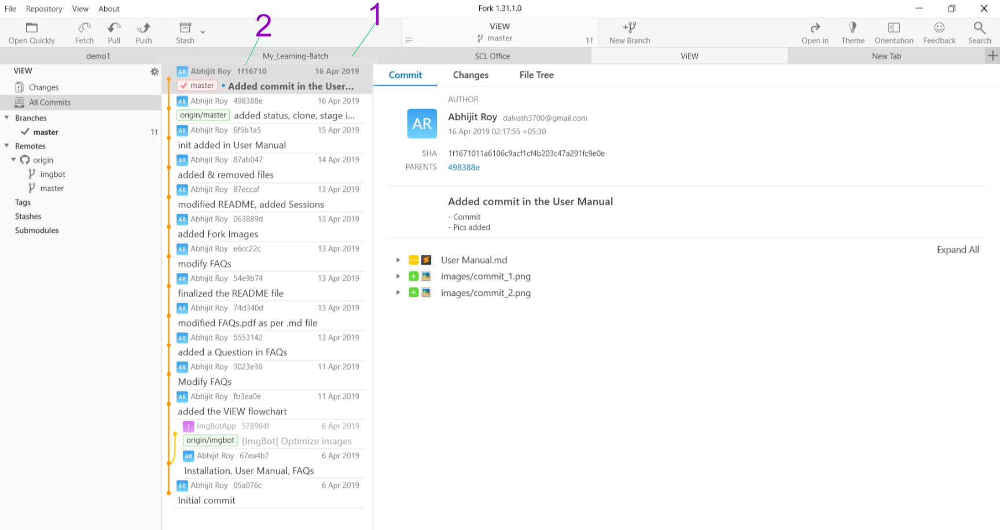
	</p>	
	In the Image above, <br/>
	<kbd>1</kbd> - Latest block (with files changes) added <br/>
	<kbd>2</kbd> - commit Hash (unique Cryptographic Hash using SHA1 Algorithm) <br/>

6. #### `push` <br/>
7. #### `fetch` <br/>
8. #### `pull` <br/>

## Utility
* `showc`
* `diffc1`
* `diffc2`
* `autopush`
* `allsync`

## Advanced Features
* Binary File - TODO
* Ignore/Allow specified files - TODO
* File change security - TODO
* Old Block security -  TODO
