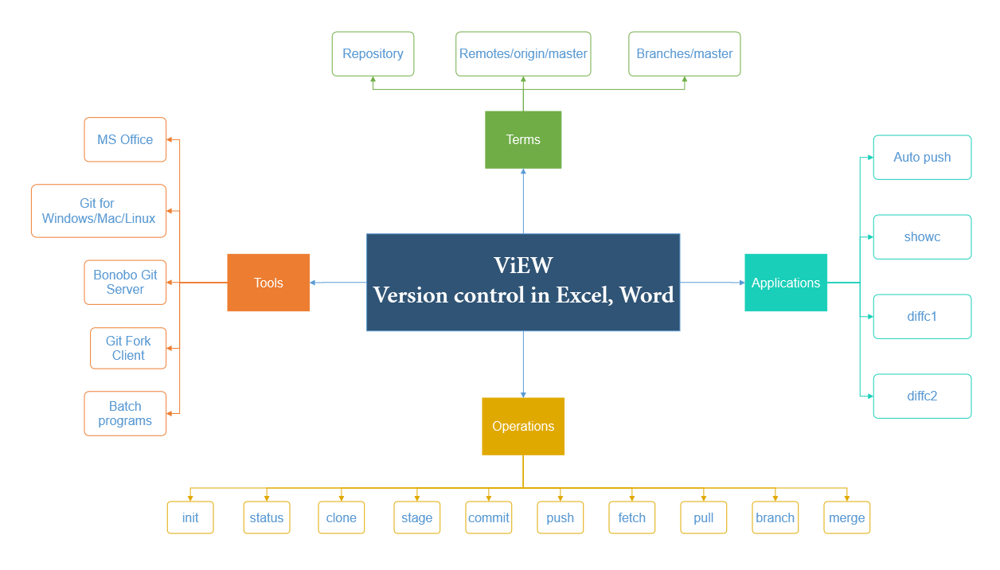

# ViEW (Version control system in Excel, Word)
### Version: 0.1
A software tool to use Git in Office | Excel, Word

## Tools Installation
#### MS Excel 2013 Professional Plus
#### [Bonobo Git Server](./Installation/Bonobo%20Git%20Server)
#### [Fork Git Client](./Installation/Fork%20Git%20Client)
#### [Git for Windows](./Installation/Git%20for%20Windows)
#### [Batch programs](./Installation/Batch%20programs)
#### Environment PATH variables

## Terms
1. #### `Repository`  
	__Repository__ is termed as any folder with files (any format), sub-folders inside it.

	

	  
	

2. #### `remotes/origin/master`  
	It refers to the __master__ (or main) branch of the repository kept at remote server.

3. #### `branch/master`  
	It refers to the __master__ (or main) branch of the repository kept at local storage (like PC, desktop).
4. #### `init`  
5. #### `status`  
6. #### `clone`  
7. #### `stage`  
8. #### `commit`  
9. #### `push`  
10. #### `fetch`  
11. #### `pull`  

## Utility
* `showc`
* `diffc1`
* `diffc2`
* `autopush`
* `allsync`